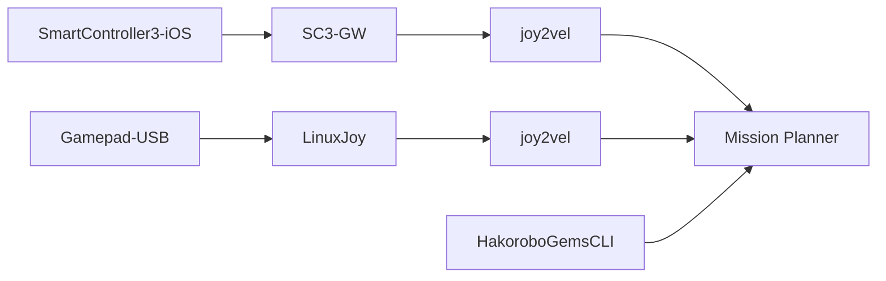
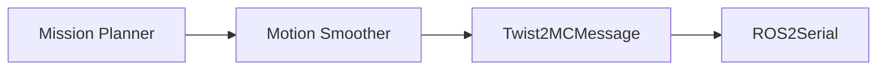
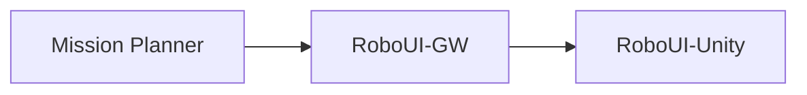

# AdaOS Design

## AdaOS.Manual (dot manual)
ロボットを手動で動かす。

**コントローラや各種ツールとの接続**

```mermaid
flowchart LR

SmartController3-iOS --> A[SC3-GW]
A --> B[joy2vel]
Gamepad-USB --> JL[LinuxJoy]
JL --> B2[joy2vel]

B --> C[Mission Planner]
B2 --> C
HakoroboGemsCLI --> C
```

**ハードウェアとの接続とコントロール**

```mermaid
flowchart LR

MP[Mission Planner] --> A[Motion Smoother]
A --> B[Twist2MCMessage]
B --> ROS2Serial
```

**ユーザーインターフェイスとの接続**

```mermaid
flowchart LR

MP[Mission Planner] --> A[RoboUI-GW]
A --> RoboUI-Unity
```